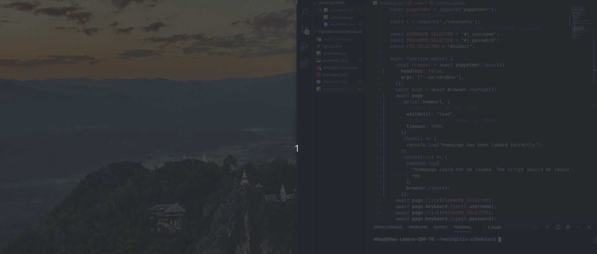

# Meningitis App Scheduler

This is a custom script to schedule the execution of the MeningitisApp app. For online instances/deployments of DHIS2 it can be run from anywhere, but for offline ones should be run from each offline server.

## How to run the script

1. Install node.js from here https://nodejs.org/ or check if you already have an instance running with `which node`
2. Clone https://github.com/velasvalen17/meningitis-scheduler.git
3. Give full permissions to your user over the cloned folder with `sudo chown <user>:<user> ./meningitis-scheduler`
4. Install Puppeteer dependencies in the new folder you have just cloned with `npm i puppeteer`
5. Edit `constants.js` and add the user, pass and server url information for the specific server you are going to access
6. Run the script with `npm run start`
7. After a few seconds an image called "example.png" should have appeared in your cloned folder. Check it out to see MeningitisApp executed.

## How to schedule

In order to schedule the execution, we need to create a task in the crontab manager:

1. Open the crontab manager with `sudo crontab -e`
2. Add this line as example to execute the script every minute: `* * * * * cd /home/ehas/meningitis-scheduler && /usr/bin/node ./scheduler.js`
3. This line will execute ./scheduler from its folder with /usr/bin/node (which is the usual place where node is)
4. If you want to try the crontask on demand, you can install cronitor from here: https://cronitor.io/docs/using-cronitor-cli and once is installed you can execute a selected crontask with the command `sudo cronitor select`
5. For Windows OS it should be done with "Task Scheduler" instead of crontab, but following the same principles

## Features

- The main method is in scheduler.js but we have enabled another file for env variables as {user, password, homeurl, appurl} called constants.js, so these can be changed without editing the main method.
- Puppeteer downloads a light version of Chrome browser called Chromium, so it can execute it in a headless mode and render all the react code from MeningitisApp. For debugging purposes, Puppeteer can execute Chromium with UI modifying the schedule.js code like this:
  ```javascript
  const browser = await puppeteer.launch({
    headless: false, //add this line
    args: ["--no-sandbox"],
  });
  ```

## What the script looks like

This is how it looks like when it is executed with headless attribute set to false:



## Dependencies

- nodejs
- puppeteer
- cronitor `--optional`
